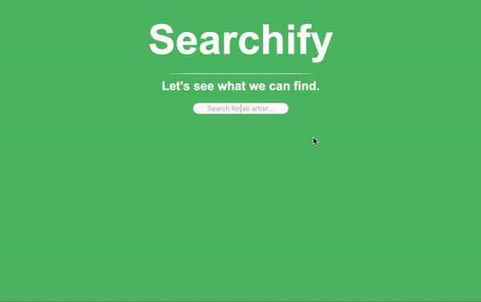

# Searchify
An interactive application for exploring new artists on Spotify.



## Getting Started

### Dependencies
`nvm` is recommended for installing npm on your system. The following command will fetch the install script for `nvm`:
 ```
 $ curl -o- https://raw.githubusercontent.com/nvm-sh/nvm/v0.39.7/install.sh | bash
 ```

 You can verify the installation in a new terminal using:
 ```
 command -v nvm
 ```

To download, compile, and install the latest release of node, use:

```
nvm install node
```

### Starting the App
```
$ cd app
$ npm install
$ node server.js
```

The app will be running from http://localhost:3000/

### Using the App
Log in using your Spotify credentials in order to begin exploring artists.

Once you've logged in, you can search for any artist to see a few key data points:
- artist name
- artist profile image
- number of followers
- primary genre
- a list of related artists

From this view, you can navigate to similar related artists simply by clicking their name/image.

By repeating this process, you can stumble across new artists to check out on Spotify based on your original search.

## Help
Depending on your browser settings, you may be prompted to authorize 
your account on every search.

## Authors
- Michael James Martin  
- Chance Shipley

## License
This project is licensed under the MIT License - see the LICENSE.md file for details.